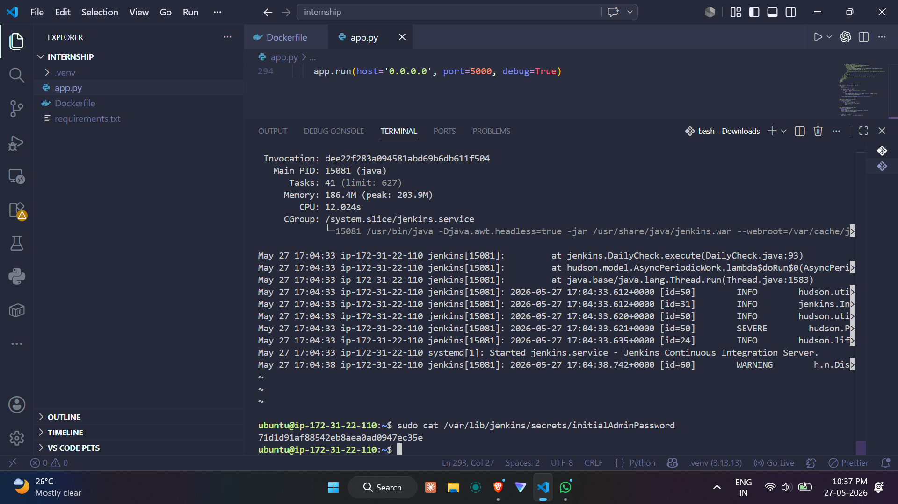

> 💡 **Before reading this document**, check out my other DevOps projects including an end-to-end Terraform CI/CD production-grade project → [aws-cicd-terraform-project](https://github.com/tarun08-code/aws-cicd-terraform-project)
>
> I have plenty of cloud and DevOps projects on my GitHub — feel free to explore!
>
> I used Claude AI to help debug issues and document this project. I believe using AI as a tool makes the process faster and more efficient.

Feel free to checkout all the screenshots for proof 

## How This Works (Simple Version)

so basically when you push code to GitHub → Jenkins on AWS EC2 picks up the changes via GitHub hook → builds the app and creates a Docker image → pushes the latest image to Docker Hub
now since we're not using Kubernetes on the cloud (AWS EKS costs ~$72/month) we manually trigger the deployment on our local K8s cluster → Kubernetes creates pods → your app goes live!
also to save money we use Docker containers as Jenkins build nodes — once the build is done the container gets terminated automatically. no wasted resources 

# TaskManager CI/CD Pipeline -------------------------------------------------------------------

A production-style CI/CD pipeline for a Flask Task Manager application using Jenkins, Docker, Kubernetes, Uptime Kuma and GitHub.

# Project Overview

This project demonstrates a complete CI/CD pipeline where:

- Code pushed to GitHub automatically triggers Jenkins
- Jenkins builds and pushes a Docker image to Docker Hub
- Kubernetes runs the application locally using Docker Desktop
- Uptime Kuma monitors the application health

# Architecture

Developer → GitHub → Jenkins (AWS EC2) → Docker Hub → Kubernetes (Local) → App Live

# Prerequisites

## Accounts Required (free tier)

| Account | Purpose | Link |
| GitHub | Source code hosting | github.com |
| Docker Hub | Store Docker images | hub.docker.com |
| AWS Free Tier | Host Jenkins server | aws.amazon.com/free |

# Software Required (Local Windows Machine)

| Software | Purpose | Download |
| Git | Version control | git-scm.com |  
| Docker Desktop | Run containers + Kubernetes | docker.com/products/docker-desktop |
| VS Code (optional) | Code editor | code.visualstudio.com |

Credentials & Tokens Needed

| Service | What You Need | Where It's Used |

| GitHub | Personal Access Token (repo scope)| Jenkins pulls code |
| Docker Hub | Access Token (Read & Write scope) | Jenkins pushes image |
| AWS | Regular account login | Launch EC2 from console |

How to Create GitHub Token

1. GitHub → Settings → Developer Settings
2. Personal Access Tokens → Tokens (classic)
3. Generate new token → select **repo** scope
4. Copy and save the token

How to Create Docker Hub Token

1. hub.docker.com → Account Settings → Security
2. New Access Token → select **Read & Write**
3. Copy and save the token

## Python (local) setup

Follow these steps to run the application locally without Docker.

1. Create and activate a virtual environment

Windows (PowerShell):

```powershell
python -m venv .venv
.\.venv\Scripts\Activate.ps1
```

Windows (CMD):

```cmd
python -m venv .venv
.\.venv\Scripts\activate.bat
```

macOS / Linux (bash):

```bash
python3 -m venv .venv
source .venv/bin/activate
```

2. Upgrade pip and install dependencies

```bash
python -m pip install --upgrade pip
pip install -r requirements.txt
```

3. Run the app locally

```bash
python app.py
# The app listens on port 5000 by default (see Dockerfile).
```

If you prefer to use Flask's development server instead, set `FLASK_ENV=development` and run `flask run` after setting `FLASK_APP=app.py`.

## AWS EC2 Setup (Jenkins Server)

Launch EC2 Instance

1. Login to AWS Console → EC2 → Launch Instance
2. Choose **Ubuntu 22.04 LTS**
3. Instance type: **t2.micro** (free tier)
4. Storage: **20GB** (increase from default 8GB)
5. Security Group — open these ports:
   - Port 22 (SSH)
   - Port 8080 (Jenkins)
   - Port 80 (HTTP)
6. Launch and download your `.pem` key file


Connect to it:

```bash
ssh -i your-key.pem ubuntu@your-ec2-public-ip
```

Before accessing EC2 via IP, ensure inbound rules are set in the instance security group.


--- Jenkins Installation (on EC2)

Refer to the official Jenkins documentation: https://www.jenkins.io/doc/book/installing/linux/#debianubuntu


sudo apt update
sudo apt install -y fontconfig openjdk-17-jre

# Install Jenkins

sudo wget -O /usr/share/keyrings/jenkins-keyring.asc \
 https://pkg.jenkins.io/debian-stable/jenkins.io-2023.key
echo "deb [signed-by=/usr/share/keyrings/jenkins-keyring.asc]" \
 https://pkg.jenkins.io/debian-stable binary/ | sudo tee \
 /etc/apt/sources.list.d/jenkins.list > /dev/null
sudo apt update
sudo apt install -y jenkins

# Start Jenkins

sudo systemctl start jenkins
sudo systemctl enable jenkins

```

Access Jenkins at: `http://your-ec2-public-ip:8080`

Initial Jenkins admin password:

- Linux/Unix: `/var/lib/jenkins/secrets/initialAdminPassword` or `/var/jenkins_home/secrets/initialAdminPassword`
- Windows: `C:\Program Files\Jenkins\secrets\initialAdminPassword` or `C:\Program Files (x86)\Jenkins\secrets\initialAdminPassword`
- macOS (Homebrew): `/Users/Shared/Jenkins/Home/secrets/initialAdminPassword`
- Docker: `/var/jenkins_home/secrets/initialAdminPassword` (accessible via `docker exec <container_id> cat /var/jenkins_home/secrets/initialAdminPassword`)



### Install Docker on EC2

sudo apt install -y docker.io
sudo systemctl start docker
sudo systemctl enable docker

# Add jenkins user to docker group
sudo usermod -aG docker jenkins
sudo systemctl restart jenkins

Jenkins Credentials Setup

Go to **Manage Jenkins → Credentials → Global → Add Credentials**

### GitHub Token
- Kind: `Username with password`
- Username: your GitHub username
- Password: your GitHub Personal Access Token
- ID: `github-token`

### Docker Hub Token
- Kind: `Username with password`
- Username: your Docker Hub username
- Password: your Docker Hub Access Token
- ID: `dockerhub-creds`

---

> Jenkinsfile

Create a `Jenkinsfile` in the root of your GitHub repo:

Refer - Jenkinsfile

> Docker Setup

FROM python:3.9-slim

WORKDIR /app

COPY requirements.txt .

RUN pip install --no-cache-dir -r requirements.txt

COPY . .

EXPOSE 5000

CMD ["python", "app.py"]

> Kubernetes Setup (Local - Docker Desktop)

Why Local Kubernetes?

AWS EKS costs **~$72/month** (no free tier). We use **Docker Desktop Kubernetes** which is completely free and runs on your local machine.

Enable Kubernetes in Docker Desktop

1. Open Docker Desktop → Settings
2. Click **Kubernetes** → Enable Kubernetes
3. Click **Apply & Restart**
4. Wait for green Kubernetes icon

# Verify

kubectl get nodes
# Should show: docker-desktop   Ready   control-plane

# Kubernetes manifest

The full Kubernetes deployment and service manifests are kept in the repository file [k8s-deployment.yaml](k8s-deployment.yaml). Refer to that file for the complete configuration.

# Deploy

kubectl apply -f k8s-deployment.yaml
kubectl get pods

App runs at: `http://localhost:30007`

# Update to Latest Image

kubectl rollout restart deployment/taskmanager  (should be done manually since its local k8s cluster)

> Health Monitoring (Uptime Kuma)
# Run Uptime Kuma

docker run -d --name uptime-kuma -p 3001:3001 \
  -v uptime-kuma:/app/data louislam/uptime-kuma:1

Access at: `http://localhost:3001`

# Add Monitor

1. Click **Add New Monitor**
2. Monitor Type: **HTTP(s)**
3. URL: `http://your-windows-ip:30007`
4. Interval: 60 seconds
5. Click **Save**

> To find your Windows IP run `ipconfig` and look for IPv4 Address


## 📁 Project Structure

├── app.py # Flask application
├── requirements.txt # Python dependencies
├── Dockerfile # Docker image definition
├── Jenkinsfile # CI/CD pipeline definition
└── k8s-deployment.yaml # Kubernetes deployment config

---

## 🛠️ Tech Stack

| Technology   | Version | Purpose                 |
| ------------ | ------- | ----------------------- |
| Python Flask | 3.x     | Web application         |
| Jenkins      | 2.555.2 | CI/CD automation        |
| Docker       | Latest  | Containerization        |
| Kubernetes   | v1.34.1 | Container orchestration |
| Uptime Kuma  | 1.x     | Health monitoring       |

---


```
## 🛠️ Troubleshooting

### Jenkins node is offline
```bash
# check temp space
df -h

# lower the threshold in nodeMonitors.xml
sudo nano /var/lib/jenkins/nodeMonitors.xml
# change freeSpaceThreshold to 400MiB under TemporarySpaceMonitor

sudo systemctl restart jenkins
```

### permission denied on docker.sock
```bash
sudo usermod -aG docker jenkins
sudo systemctl restart jenkins
```

### push access denied to Docker Hub
```bash
# check your logged in username
docker info | grep Username

# re-tag with correct username
docker tag old-name/image:tag correctusername/image:tag

# make sure your token has Read & Write scope
docker logout
docker login
```

### Jenkins build not triggering on code push
- Go to Jenkins job → Configure
- Enable **GitHub hook trigger for GITScm polling**
- Go to GitHub repo → Settings → Webhooks
- Add webhook: `http://your-ec2-ip:8080/github-webhook/`

### kubectl not connecting to cluster
```bash
# switch to correct context
kubectl config use-context docker-desktop

# verify
kubectl get nodes
```

### App not accessible on localhost:30007
```bash
# check if pods are running
kubectl get pods

# check if service exists
kubectl get services

# restart deployment to pull latest image
kubectl rollout restart deployment/taskmanager
```

### Uptime Kuma showing red
```bash
# find your windows IP
ipconfig
# use IPv4 address instead of localhost
# URL should be http://your-windows-ip:30007
```
cost saving tips on cloud platforms 

1. Use Lightweight Docker Base Image
2. Multi-stage Docker Build
3. Clean Docker regularly on EC2
4. Keep only last 3 builds in Jenkins